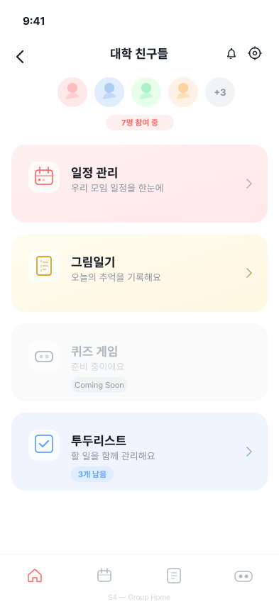
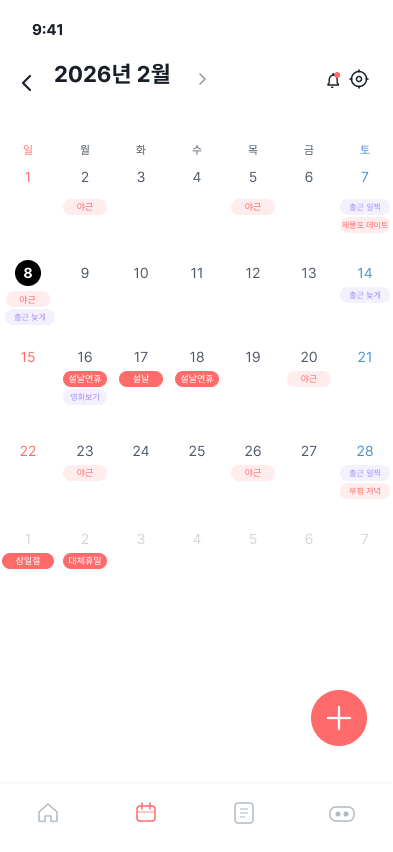
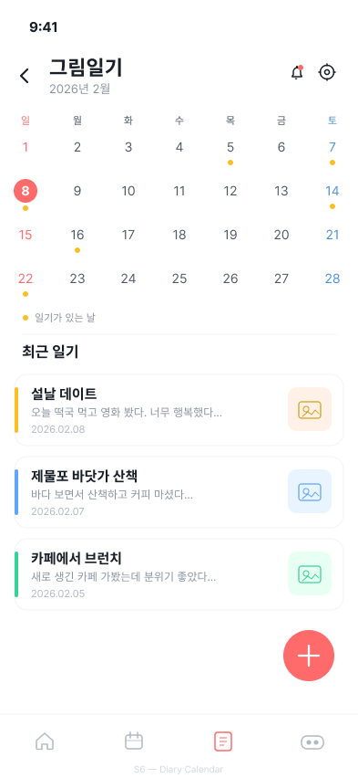
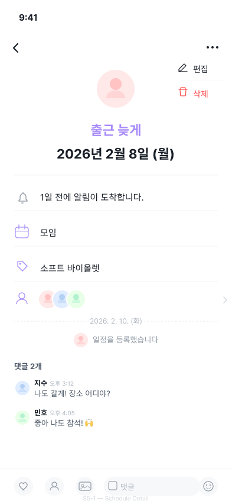
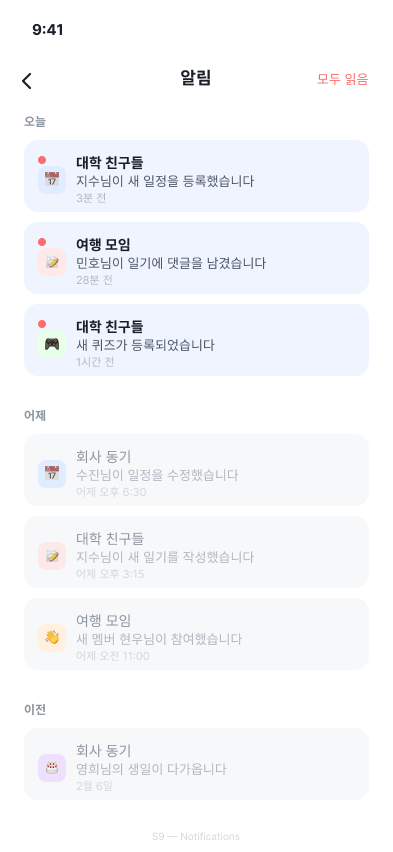
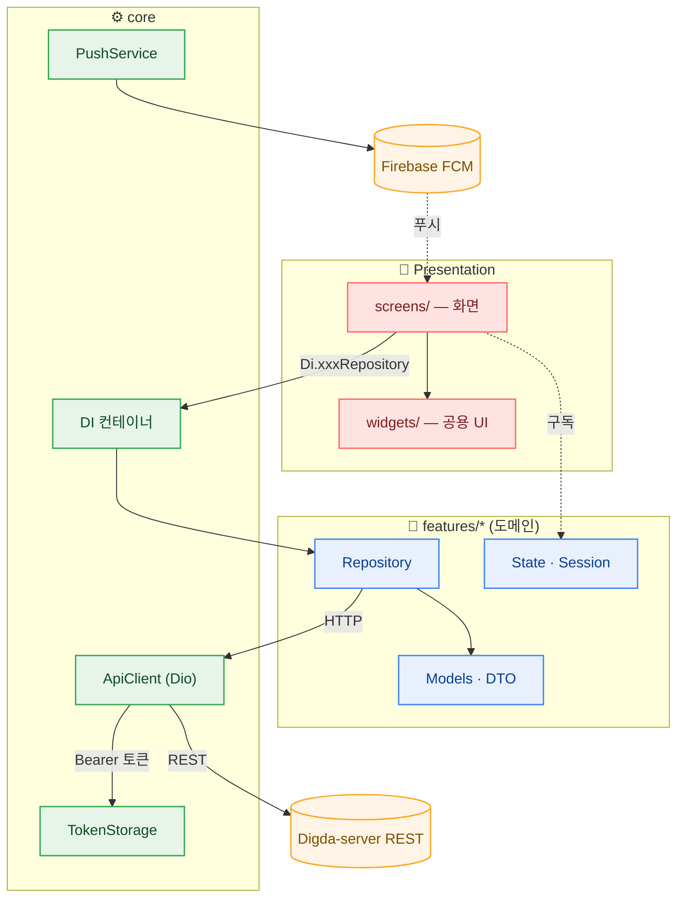

<div align="center">


# 디그팟 · DigPot — Mobile App

**디지털 그룹 포켓 (Digital Group Pocket)** · 가족·연인·친구를 위한 비공개 그룹 다이어리 앱

[](https://flutter.dev)
[](https://dart.dev)
[](#)

운영사 **태리팟(Taeripot)** · 백엔드 [Digda-server](https://github.com/DateDiary/Digda-server) · 관리자 [digda-admin](https://github.com/DateDiary/digda-admin)

</div>

> 본 문서는 **내부 개발자용** 안내입니다. 신규 합류자가 서비스와 앱 구조를 빠르게 이해하는 데 초점을 둡니다.
> (빌드/배포 절차는 사내 위키·CI 설정을 따릅니다.)

---

## 📖 서비스 소개

**디그팟**은 초대 코드로 모인 소규모 그룹이 일상을 함께 기록하는 모바일 앱입니다.
한 그룹 안에서 그날의 그림일기를 남기고, 일정을 공유하고, 함께 키우는 마스코트 **모찌**로
"같이 기록하는 즐거움"을 제공합니다. 모든 콘텐츠는 그룹 밖으로 노출되지 않는 **비공개**가 기본입니다.

---

## 📱 주요 화면 & 기능

각 화면은 디자인 기준 화면입니다. *(실기기 캡처 교체 위치: `docs/screenshots/` — 동일 파일명으로 추가하면 됩니다.)*

| 화면 | 기능 설명 |
|:---:|:---|
|  | **그룹 홈** — 오늘의 일정/일기/안읽음 요약, 활성 그룹 카드와 멤버, 그룹 전환, 빠른 작업(일기·일정·퀴즈·초대), 최근 소식 피드(더보기). |
|  | **일정 캘린더** — 월/주 뷰, 다일 일정 연결 바, 멤버 필터, 공휴일 표시, 하루 최대 3개+"…", 09/12/18시 리마인더 알림. |
|  | **그림일기** — 사진 모자이크 달력, 월간 통계(기록 수·연속·기분), 하루 한 편 규칙. 작성 시 사진·기분·날씨·장소(카카오 로컬) 태깅. |
|  | **일정 상세** — 참여자 아바타, 시간/장소, 하단 댓글 입력. |
|  | **모찌 키우기** — 활동으로 EXP·레벨·진화(3·6·10·15·20), 퀴즈, 코인 상점/꾸미기, 디코 등장. |
|  | **알림 센터** — 전체/모찌/일정/일기 필터, 안읽음 배지, 푸시(FCM) 연동. |

---

## 🧩 도메인 한눈에

| 영역 | 설명 |
|---|---|
| **인증** | 카카오·네이버·Apple 소셜 로그인, JWT 세션, 자동 로그인 |
| **그룹방** | 생성·초대코드 참여, 그룹 전환, 방장 양도, 삭제 예약/복구 |
| **그림일기** | 하루 1편, 사진 다중 첨부, 기분/날씨, 장소 검색, 댓글 |
| **일정** | 월/주 캘린더, 다일 일정, 참여자, 공휴일, 리마인더 |
| **모찌** | 경험치·진화·퀴즈·상점·디코 |
| **투두 / 알림** | 그룹 공용 할 일 · FCM 푸시 + 인앱 알림 센터 |

---

## 🛠️ 기술 스택

| 구분 | 기술 |
|---|---|
| 프레임워크 | Flutter 3.41 / Dart 3.2+ |
| 상태/DI | `provider`, 경량 DI 컨테이너(`core/di.dart`) |
| 네트워크 | `dio` (토큰 주입·자동 갱신 인터셉터) |
| 라우팅 | `go_router` + `Navigator.pushNamed` |
| 로컬 | `flutter_secure_storage`, `flutter_dotenv` |
| 캘린더 | `table_calendar` + 커스텀 빌더 |
| 소셜 로그인 | `kakao_flutter_sdk_user`, `flutter_naver_login`, `sign_in_with_apple` |
| 푸시 | `firebase_messaging`, `flutter_local_notifications` |

---

## 🏗️ 앱 아키텍처

피처 단위로 `data(레포지토리) · models(DTO) · state(세션)` 를 나누고, 화면(`screens/`)은
DI 컨테이너를 통해 레포지토리에 접근합니다. 네트워크는 `ApiClient`(Dio) 1곳으로 모읍니다.



---

## 📂 프로젝트 구조

```
lib/
├── main.dart            # 진입점 (Firebase·Kakao·DI 부트스트랩, 자동 로그인 시 FCM 재등록)
├── app.dart             # MaterialApp · 딥링크 · 세션 만료 리스너
├── app_router.dart      # onGenerateRoute 라우트 테이블
├── core/                # DI · ApiClient(Dio) · TokenStorage · 환경설정 · PushService
├── features/            # 도메인별 data / models / state
│   ├── auth · group_room · diary · schedule · character
│   ├── comment · membership · invite · notification · device
│   └── place · todo · upload · user · common
├── screens/             # 화면 (auth · group · diary · schedule · character · mypage · …)
├── widgets/             # 재사용 위젯 (캘린더 타일 · 다이얼로그 · 재시도 이미지 등)
└── theme/               # colors · text_styles · dimensions
```

---

## 🤝 협업

- 통합 브랜치 **`dev`** (배포 기준) · 모든 PR base 는 `dev` · `main` 직접 승격 금지
- 라벨(Type·Priority·Status·Domain) · 이슈/PR 템플릿 · 기본 담당자(`@chltmdgh522`)는 [`.github/`](.github) 참고
- 커밋: `type(scope): 요약` (예: `feat(schedule): 주간 뷰 추가`)

<div align="center"><sub>© 2026 태리팟 · 디그팟 — Digital Group Pocket</sub></div>
