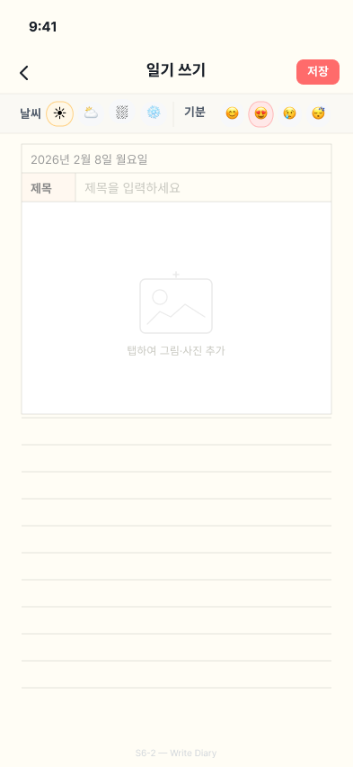
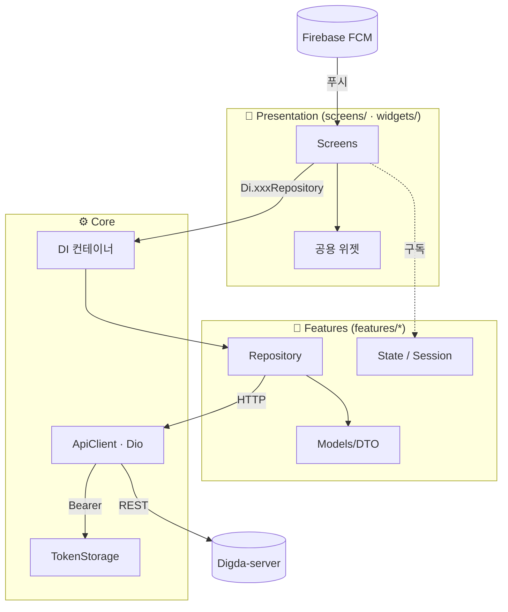

<div align="center">


# 디그팟 · DigPot

**디지털 그룹 포켓 (Digital Group Pocket)** — 가족·연인·친구를 위한 비공개 그룹 다이어리 앱

가까운 사람들과 *일기 · 일정 · 투두 · 캐릭터(모찌)* 를 한 주머니(Pocket)에 담아 함께 기록하고 공유합니다.

[](https://flutter.dev)
[](https://dart.dev)
[](#)
[](https://firebase.google.com)

운영사 **태리팟(Taeripot)** · 백엔드 [Digda-server](https://github.com/DateDiary/Digda-server) · 관리자 [digda-admin](https://github.com/DateDiary/digda-admin)

</div>

---

## 📖 서비스 소개

**디그팟**은 초대 코드로 모인 소규모 그룹이 일상을 함께 기록하는 모바일 앱입니다.
한 그룹 안에서 그날의 그림일기를 남기고, 일정을 공유하고, 함께 키우는 마스코트 **모찌**를 통해
"같이 기록하는 즐거움"을 제공합니다. 모든 콘텐츠는 그룹 밖으로 노출되지 않는 **비공개**가 기본입니다.

- 🔒 **비공개 그룹** — 초대 코드로만 입장, 외부 비노출
- 🖼️ **그림일기** — 하루 한 편, 사진·기분·날씨·장소와 함께
- 📅 **공유 일정** — 월/주 캘린더, 멤버 필터, 리마인더 알림
- 🐱 **모찌 키우기** — 활동으로 경험치를 모아 진화하는 그룹 캐릭터
- ✅ **투두리스트** — 함께 할 일 관리
- 🔔 **푸시 알림** — 일정·일기·댓글·그룹 활동 실시간 알림

---

## ✨ 주요 화면

| 그룹 홈 | 일정 캘린더 | 그림일기 |
|:---:|:---:|:---:|
|  |  |  |
| 대시보드·그룹 전환·빠른 작업 | 월/주 뷰·멤버 필터·공휴일 | 사진 모자이크 달력·통계 |

| 일기 작성 | 일정 상세 | 알림 |
|:---:|:---:|:---:|
|  |  |  |
| 사진·기분·장소 태깅 | 참여자·댓글 | 타입별 필터 |

> 위 이미지는 디자인 와이어프레임입니다. 실제 빌드 화면은 디자인 리뉴얼이 반영되어 일부 다를 수 있습니다.

---

## 🧩 핵심 기능

| 영역 | 설명 |
|---|---|
| **인증** | 카카오 · 네이버 · Apple 소셜 로그인, JWT 세션, 자동 로그인, 약관 동의 |
| **그룹방** | 생성·초대코드 참여, 그룹 전환, 방장 양도, 삭제 예약/복구 |
| **그림일기** | 하루 1편, 사진 다중 첨부, 기분/날씨, 카카오 로컬 장소 검색, 댓글 |
| **일정** | 월/주 캘린더, 다일 일정, 참여자 지정, 공휴일 표시, 09/12/18시 리마인더 |
| **모찌(캐릭터)** | 경험치·레벨·진화 단계, 퀴즈, 상점/꾸미기, 디코 등장 |
| **투두** | 그룹 공용 할 일 관리 |
| **알림** | FCM 푸시 + 인앱 알림 센터(타입별 필터) |

---

## 🛠️ 기술 스택

| 구분 | 사용 기술 |
|---|---|
| **프레임워크** | Flutter 3.41 / Dart 3.2+ |
| **상태 관리** | `provider` (ChangeNotifier 기반 세션/DI) |
| **라우팅** | `go_router`, `Navigator.pushNamed` |
| **네트워크** | `dio` (인터셉터로 토큰 주입·갱신) |
| **로컬 저장** | `flutter_secure_storage` (토큰), `flutter_dotenv` (환경변수) |
| **캘린더 UI** | `table_calendar` + 커스텀 빌더 |
| **소셜 로그인** | `kakao_flutter_sdk_user`, `flutter_naver_login`, `sign_in_with_apple` |
| **푸시 알림** | `firebase_messaging`, `flutter_local_notifications` |
| **기타** | `image_picker`, `share_plus`, `url_launcher`, `app_links`(딥링크), `world_holidays` |

---

## 🏗️ 아키텍처

피처 단위로 `data(레포지토리) · models(DTO) · state(세션)` 를 나누고, 화면(`screens/`)은 DI 컨테이너(`core/di.dart`)를 통해 레포지토리에 접근합니다.



---

## 📂 프로젝트 구조

```
lib/
├── main.dart                # 진입점 (Firebase·Kakao·DI 부트스트랩)
├── app.dart                 # MaterialApp · 딥링크 · 세션 리스너
├── app_router.dart          # 라우트 테이블 (onGenerateRoute)
├── core/                    # DI, 네트워크(ApiClient), 인증 토큰, 환경설정, 푸시
├── features/                # 도메인별 data/models/state
│   ├── auth/  group_room/  diary/  schedule/  character/
│   ├── comment/  membership/  invite/  notification/  device/
│   └── place/  todo/  upload/  user/  common/
├── screens/                 # 화면 (auth, group, diary, schedule, character, mypage ...)
├── widgets/                 # 재사용 위젯 (캘린더 타일, 다이얼로그, 네트워크 이미지 등)
└── theme/                   # colors · text_styles · dimensions
```

---

## 🚀 실행 방법

### 사전 요구사항
- Flutter SDK 3.41 이상 (`flutter --version`)
- Android Studio / Xcode, 실기기 또는 에뮬레이터
- Firebase 프로젝트(`google-services.json`, `GoogleService-Info.plist`) — 푸시 알림용

### 설치 & 실행
```bash
# 1. 의존성 설치
flutter pub get

# 2. 환경변수 파일 작성 (프로젝트 루트 .env)
#    KAKAO_NATIVE_APP_KEY=...
#    KAKAO_JS_APP_KEY=...
#    KAKAO_REST_API_KEY=...
#    API_BASE_URL=https://<digda-server-host>

# 3. 실행
flutter run
```

### 빌드
```bash
flutter build apk --release      # Android
flutter build ipa --release      # iOS
```

---

## 🌿 브랜치 & 협업

- 기본 통합 브랜치: **`dev`** (앱/서버 모두 `dev` 에만 머지, 배포 기준)
- 작업 브랜치: `feat/*`, `fix/*`, `docs/*` → PR → `dev`
- 라벨 · 이슈/PR 템플릿 · 마일스톤 정책은 [.github/](.github) 와 조직 가이드를 따릅니다.
- 커밋 컨벤션: `type(scope): 설명` (예: `feat(schedule): 주간 뷰 추가`)

---

<div align="center">
<sub>© 2026 태리팟(Taeripot) · 디그팟(DigPot) — Digital Group Pocket</sub>
</div>
